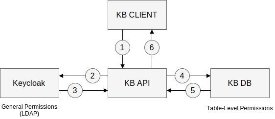

# GraphKB API

  [](https://codecov.io/gh/bcgsc/pori_graphkb_api)  [](https://www.orientdb.org/)

The GraphKB database is implemented using [orientDB](https://github.com/orientechnologies/orientdb) and [orientjs](https://github.com/orientechnologies/orientjs).
It is a graph database which is used to store variants, ontologies, and the relevance of this terms and variants. The KB uses strict controlled vocabulary to provide a parseable and machine-readable interface for other applications to build on. The API is a REST API built on node/express.

## About

### Database Schema

The [schema](https://github.com/bcgsc/pori_graphkb_schema) is defined in a separate NPM package.
In general it consists of four major types of data: ontology terms, variants, evidence, and statements.

### OpenAPI Specification

All KB API routes are documented with openapi specification. The specification is hosted with the api under `/api/spec`

### Authentication

Authentication in the KB uses tokens. KB API tokens can be generated using the token route defined in the API specification.
The first layer of authentication happens when KB uses [keycloak](https://www.keycloak.org/) to authenticate users against the LDAP. A request is sent
to keycloak with the users credentials and a token is returned if the user exists and has access to KB.

The next step happens when KB looks up the username in the KB database. Each user in KB belongs to one or more UserGroups. Each of these UserGroups contains table-level permission schemas.



In summary, KB Client will send user credentials and recieve a token which will be used in the header of all subsequent requests.

## Quick Start

Most of the time you will want the deployment instructions rather than the ones below. For
these please see the [contributing guide](./docs/CONTRIBUTING.md).

Requirements

- orientdb 3.0 or 3.1
- node v10 or v12

Clone the repository

```bash
git clone https://github.com/bcgsc/pori_graphkb_api.git
cd pori_graphkb_api
git checkout develop
```

Install the dependencies

```bash
npm install
```

To actually use the API, the orientDB instance must already be running. To configure where the tests will point to the user can either modify `config/config.js` or set the [environment variables](env.md) which override this config (default values are shown below, this will change depending on how you db server is configured).

```bash
GKB_DBS_PASS=root
GKB_DBS_USER=root
GKB_DB_HOST='HOST NAME'
GKB_DB_PORT=2480
GKB_KEY_FILE='id_rsa'  # used in generating the tokens
```

Create the keyfile (pick the current directory)

```bash
yes | ssh-keygen -t rsa -b 4096 -f id_rsa -N ''
```

After these options are configured, the server can be started

```bash
npm start
```
